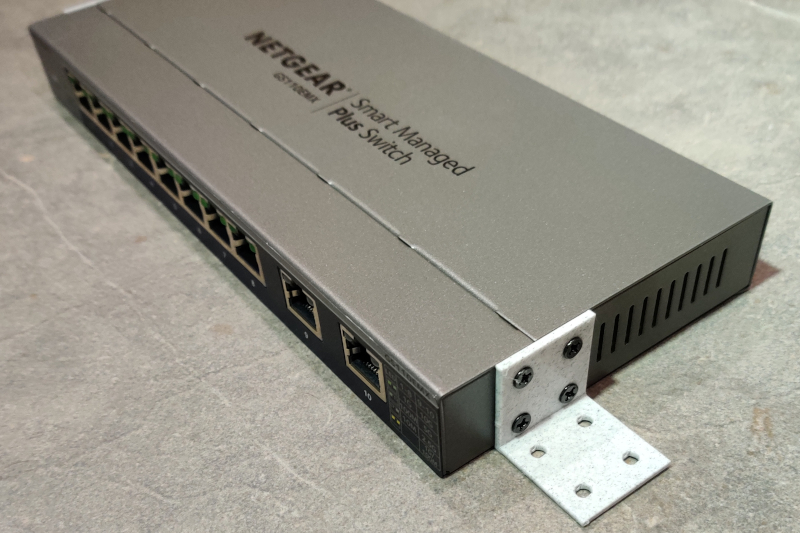
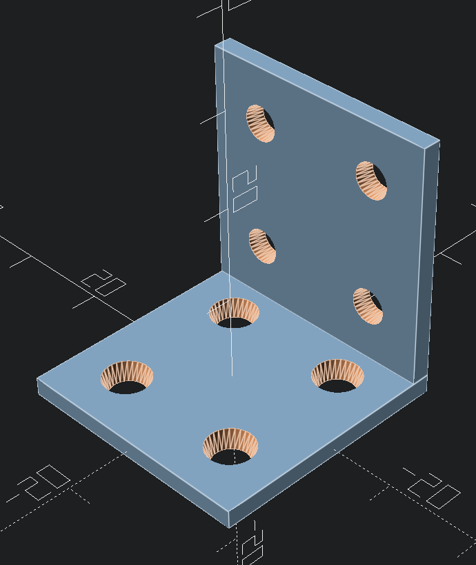

# Netgear Wallmount Rack Ears

3D printable rack ears to wall-mount short netgear switches.

Netgear switches are normally mounted to the wall with mounting points under the unit.  These brackets simply make it easier to mount.

This works with the GS110EMX and the GS108PP, but it will probably work for other switches.

